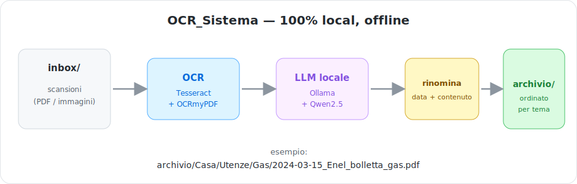

# 📂 OCR_Sistema


<p align="center"></p>

> 🇬🇧 **EN** — Automatic filing of scanned documents, **100% local and offline**.
> Drop your scans into a folder; the system runs OCR, understands what each
> document is using a local LLM, **renames** it with date and content, and
> **sorts** it into topic folders. No data ever leaves your computer.
>
> 🇮🇹 **IT** — Catalogazione automatica di documenti scansionati, **100% locale e
> offline**. Butti le scansioni in una cartella; il sistema fa OCR, capisce di
> cosa si tratta con un modello LLM locale, **rinomina** ogni file con data e
> contenuto e lo **smista** in cartelle tematiche. Nessun dato lascia il computer.
>
> 🇪🇸 **ES** — Archivado automático de documentos escaneados, **100% local y sin
> conexión**. Pon tus escaneos en una carpeta; el sistema hace OCR, entiende de
> qué trata cada documento con un modelo LLM local, lo **renombra** con fecha y
> contenido y lo **clasifica** en carpetas temáticas. Ningún dato sale del equipo.

```
inbox/scanned_bill.pdf
   └─► archivio/Casa/Utenze/Gas/2024-03-15_Enel_bolletta_gas.pdf
```

## Features
- **Offline & private**: OCR (Tesseract) + local LLM (Ollama + Qwen2.5) — zero cloud.
- **Automatic**: a watcher checks `inbox/` every 15 minutes and processes on its own.
- **Meaningful renaming**: `YYYY-MM-DD_Sender_Type_Detail.pdf`.
- **Topic sorting**: configurable category tree (`categorie.yaml`).
- **Safe**: originals are always kept; uncertain documents go to `_DaSmistare/`
  (never filed at random); operations are reversible; full-text search (SQLite FTS5).
- **Cross-platform**: macOS, Linux, Windows, with native notifications.
- **Ollama at rest**: the model (~5GB) is unloaded from RAM when idle.

## Requirements
- Python 3.9+
- [Tesseract](https://github.com/tesseract-ocr/tesseract) (Italian language data),
  [OCRmyPDF](https://ocrmypdf.readthedocs.io/), [Ollama](https://ollama.com) +
  the `qwen2.5:7b` model
- RAM: 8GB minimum, 16GB recommended · Disk: ≥10GB free

## Installation
```bash
# macOS / Linux
bash _engine/setup.sh
# Windows (PowerShell)
powershell -ExecutionPolicy Bypass -File _engine\setup.ps1
```
The setup checks your **hardware**, installs every component (including the local
LLM model) and configures automatic startup (LaunchAgent / systemd / Task Scheduler).

## Usage
1. Put your documents (PDFs or images) into `inbox/`.
2. Within 15 minutes they are processed and sorted into `archivio/`.
3. Check `_DaSmistare/` for the few uncertain documents.

Commands: `ocr-check` (hardware/component diagnostics), `ocr-processa` (run a
pass now), `ocr-cerca "words"` (full-text search).

More details and portability: see [README_PORTABILITA.md](README_PORTABILITA.md),
[GUIDA.md](GUIDA.md), [CHECKLIST.md](CHECKLIST.md).

## Tests
```bash
cd _engine && .venv/bin/python -m pytest tests/ -q
```

## Architecture
- `_engine/ocrsys/` — modules (config, ocr, classify, pipeline, runner, db,
  taxonomy, dates, naming, locking, notify, ollama_mgr, hardware, preflight)
- `_engine/watch.py` — cross-OS daemon · `_engine/ocr_processa.py` / `ocr_cerca.py`
  / `check.py` — commands
- data (gitignored): `inbox/ archivio/ originali/ text/ _DaSmistare/`

## Contributing
Contributions are welcome! See [CONTRIBUTING.md](CONTRIBUTING.md).

## License
[MIT](LICENSE) © 2026 Lorenzo Chieregato
