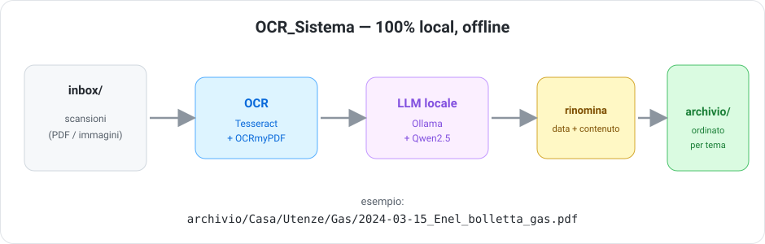

# 📂 OCR_Sistema


<p align="center"></p>

> 🇬🇧 **EN** — Automatic filing of scanned documents, **100% local and offline**.
> Drop your scans into a folder; the system runs OCR, understands what each
> document is using a local LLM, **renames** it with date and content, and
> **sorts** it into topic folders. No data ever leaves your computer.
>
> 🇮🇹 **IT** — Catalogazione automatica di documenti scansionati, **100% locale e
> offline**. Butti le scansioni in una cartella; il sistema fa OCR, capisce di
> cosa si tratta con un modello LLM locale, **rinomina** ogni file con data e
> contenuto e lo **smista** in cartelle tematiche. Nessun dato lascia il computer.
>
> 🇪🇸 **ES** — Archivado automático de documentos escaneados, **100% local y sin
> conexión**. Pon tus escaneos en una carpeta; el sistema hace OCR, entiende de
> qué trata cada documento con un modelo LLM local, lo **renombra** con fecha y
> contenido y lo **clasifica** en carpetas temáticas. Ningún dato sale del equipo.

```
inbox/scanned_bill.pdf
   └─► archivio/Casa/Utenze/Gas/2024-03-15_Enel_bolletta_gas.pdf
```

## Features
- **Offline & private**: OCR (Tesseract) + local LLM (Ollama + Qwen2.5) — zero cloud.
- **Automatic**: a watcher checks `inbox/` every 15 minutes and processes on its own;
  empty leftover subfolders are pruned automatically.
- **Meaningful renaming**: `YYYY-MM-DD_Sender_Type_Detail.pdf`.
- **Topic sorting**: configurable category tree (`categorie.yaml`); high-volume
  categories can auto-split into per-year subfolders (`categorie_per_anno`).
- **Native-text aware**: digitally-signed / born-digital PDFs (PEC, contracts) are
  used as-is without re-OCR — no more `DigitalSignatureError` quarantine.
- **Vision fallback**: image-only scans Tesseract can't read are classified by a
  local vision model (`qwen2.5vl`); the text and vision models never share RAM.
- **Email intake**: PDF attachments of Gmail messages you label `Add_OCR` are
  pulled into `inbox/` automatically (IMAP, dedup, 4×/day + on the daemon cycle).
- **Search**: full-text (SQLite FTS5) **and** semantic (local `nomic-embed-text`
  embeddings) — find "spese dentista" even if the document says "odontoiatra".
- **Local web UI** (`http://localhost:8077`): search, browse by category, stats,
  edit a document's category/date/sender/tags, download CSV/ZIP.
- **Content de-duplication**: same document scanned/exported twice (different bytes)
  is detected by a normalized-text signature; the fuller copy is kept, the other
  moved to `duplicati/` (reversible). A high text threshold avoids false positives.
- **Review queue**: a web page collecting low-confidence and unsorted documents to
  fix in one place; a Telegram bot to search the archive from your phone.
- **Scanner-aware**: pauses processing while a scanner app is open (no half-written
  scans); a boilerplate cleaner strips repeated headers before the LLM.
- **Exports**: full catalog to CSV, ZIP by category or by search, full backup.
- **Editable prompts**: the classification/vision prompts live in `prompts/*.txt`.
- **Safe**: uncertain documents go to `_DaSmistare/` (never filed at random);
  operations are reversible; an append-only `audit.log` records every mutation.
- **Robust**: hard timeouts on every subprocess (a corrupt PDF can't hang the
  daemon), single-lock mutual exclusion, quarantine + retry, health notifications.
- **Hardened web UI**: HTML-escaped output (no XSS from document content),
  CSRF-protected edits, restrictive CSP, localhost-only.
- **Reliable storage**: SQLite in WAL mode (safe concurrent read/write); nightly
  maintenance — integrity-checked DB backup (rotated), DB↔files reconcile,
  de-dup, metadata enrichment, semantic reindex.
- **Cross-platform**: macOS, Linux, Windows, with native notifications.
- **Ollama at rest**: models (~5GB) are unloaded from RAM when idle.

## Requirements
- Python 3.9+
- [Tesseract](https://github.com/tesseract-ocr/tesseract) (Italian language data),
  [OCRmyPDF](https://ocrmypdf.readthedocs.io/), [Ollama](https://ollama.com) +
  the `qwen2.5:7b` model
- Optional: `poppler` (pdftoppm) + `qwen2.5vl:7b` for the **vision** fallback;
  `nomic-embed-text` for **semantic** search — all local
- RAM: 8GB minimum, 16GB recommended · Disk: ≥10GB free

## Installation
```bash
# macOS / Linux
bash _engine/setup.sh
# Windows (PowerShell)
powershell -ExecutionPolicy Bypass -File _engine\setup.ps1
```
The setup checks your **hardware**, installs every component (including the local
LLM model) and configures automatic startup (LaunchAgent / systemd / Task Scheduler).

## Usage
1. Put your documents (PDFs or images) into `inbox/` — or label Gmail messages
   `Add_OCR` (see `.email.yaml.esempio`), or scan straight into `inbox/`.
2. Within 15 minutes they are processed and sorted into `archivio/`.
3. Check `_DaSmistare/` for the few uncertain documents.

### Commands
| Command | What it does |
|---|---|
| `ocr-processa` | run a pass now (`--dry-run`, `--interactive`) |
| `ocr-cerca "words"` | full-text search · `--semantica` for meaning-based |
| `ocr-web` | open the local web UI (`http://localhost:8077`) |
| `ocr-stato` | archive health: volumes, metadata quality, categories |
| `ocr-sposta "name" "Cat/Sub"` | re-file a document (fixes file + DB + index) |
| `ocr-esporta indice\|categoria\|cerca\|backup` | CSV / ZIP / full backup |
| `ocr-arricchisci` | LLM pass to fill missing tags/sender |
| `ocr-indicizza` | (re)build the semantic index |
| `ocr-duplicati [--applica]` | find duplicate documents, keep the fuller copy |
| `ocr-vision-recover` | classify image-only scans with the vision model |
| `ocr-recupera` | reprocess the quarantine (`_DaSmistare/_errori`) |
| `ocr-manutenzione` | run the nightly maintenance now |
| `ocr-backup-db` | integrity-checked DB snapshot (rotated) |
| `ocr-telegram` | run the Telegram search bot |
| `ocr-check` / `ocr-check-db --fix` | diagnostics · DB↔files reconcile |
| `ocr-scarica-email` | fetch labelled Gmail PDFs now |

More details and portability: see [README_PORTABILITA.md](README_PORTABILITA.md),
[GUIDA.md](GUIDA.md), [CHECKLIST.md](CHECKLIST.md).

## Tests
```bash
cd _engine && .venv/bin/python -m pytest tests/ -q
```

## Architecture
- `_engine/ocrsys/` — modules (config, ocr, classify, pipeline, runner, db,
  taxonomy, dates, naming, locking, notify, ollama_mgr, hardware, preflight,
  vision, email_fetch, semantic, export, testo, dedup, scanner_lock, salute,
  telegram, prompts, audit)
- `_engine/watch.py` — cross-OS daemon · `webapp.py` — local web UI ·
  `manutenzione.py` — nightly job · plus one entry point per command
- background jobs (macOS LaunchAgents): `com.ocrsistema.watch` (OCR loop +
  email + scanner-pause + health), `com.ocrsistema.email` (4×/day intake),
  `com.ocrsistema.web` (web UI), `com.ocrsistema.manutenzione` (nightly:
  backup + reconcile + de-dup + enrich + reindex)
- data (gitignored): `inbox/ archivio/ _DaSmistare/`; system files, logs,
  `duplicati/`, `prompts/`, `audit.log` under `_Sistema/`

## Contributing
Contributions are welcome! See [CONTRIBUTING.md](CONTRIBUTING.md).

## License
[MIT](LICENSE) © 2026 Lorenzo Chieregato
